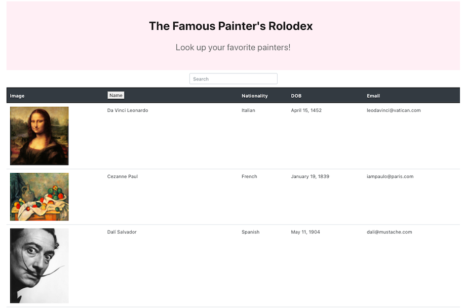

# REACT: FAMOUS PAINTERS ROLODEX

## Description

Created a painter directory with React. The user is able to search for famous painters - while searching, the results matching with first letters typed will appear first in the table. The user can also filter painters by name in alphabetical order.

## Table of Contents

1. [Usage](#Usage)
2. [Github repository and Heroku deployed app link](#Github-repository-Heroku-deployed-link)
3. [App-screenshots](#App-screenshots)
4. [Questions](#Questions)

## Usage

- Click on the deployed app link and search for your favorite painters!

### Github-repository-Heroku-deployed-link

- Github repository:
  [Github repository](https://github.com/JessicaPerez1/Famous-Painters-React.git)
- Heroku Deployed link:
  [Heroku deployed app link](https://cryptic-sea-20756.herokuapp.com/)

### App-screenshots

### Questions

For any questions about this app or if you'd like to contribute, please refer to my Github page or contact me by email!

- [JessicaPerez1 Github link](https://github.com/JessicaPerez1)
- 1jessicaperez@gmail.com
